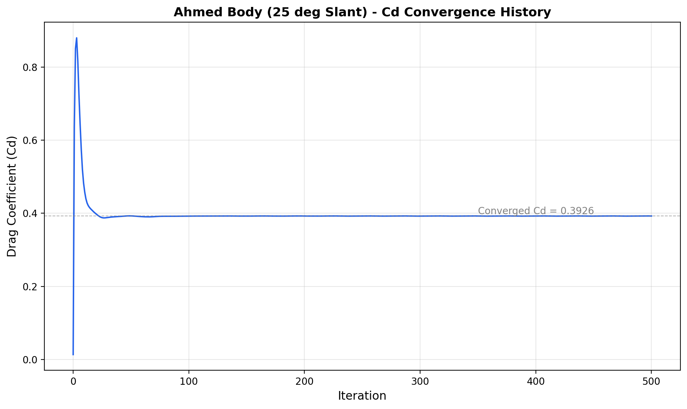
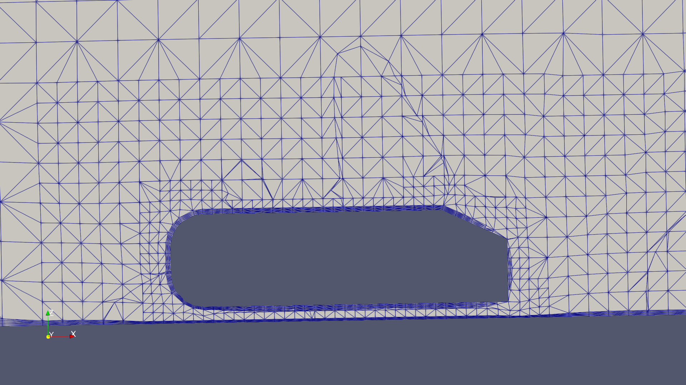
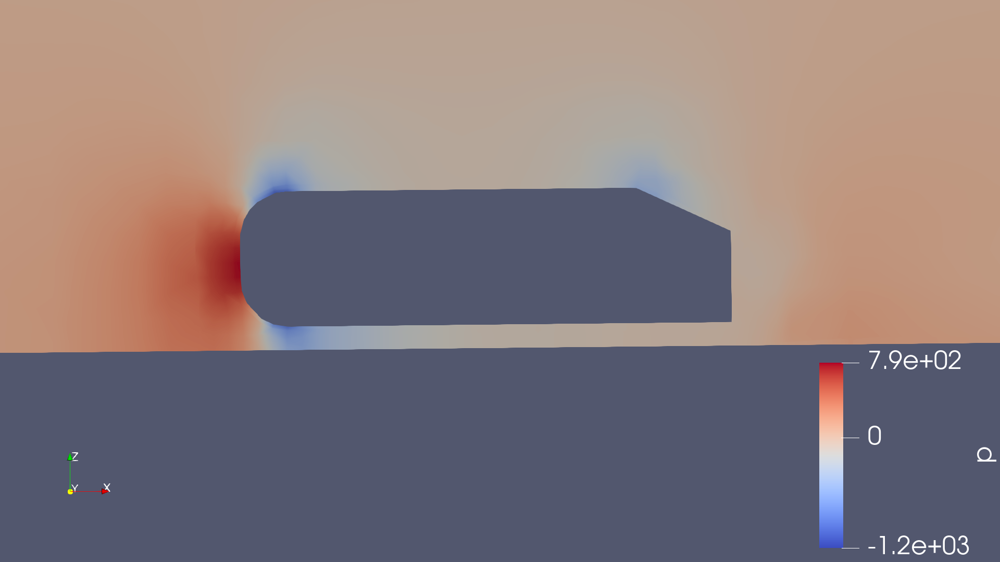
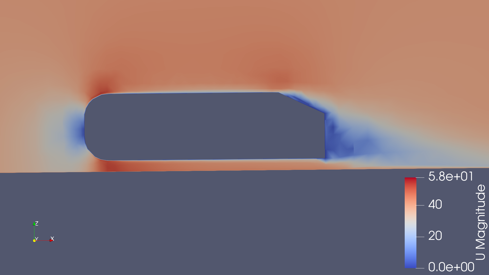
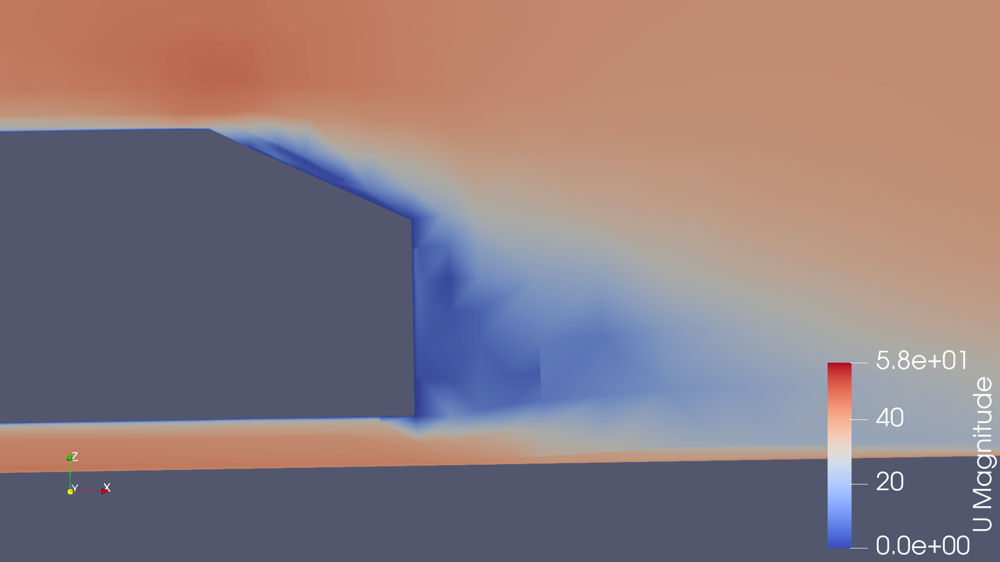

# Ahmed Body Aerodynamic Wake Study (OpenFOAM)

Independent CFD study of flow separation and wake structure over the Ahmed body (25° slant), built to close a specific tooling gap identified during my UK aerodynamics job search: hands-on OpenFOAM experience, alongside my existing ANSYS Fluent background from my MSc thesis.

## Background

My MSc thesis at Cranfield University characterised bluff body wake topology and flow separation using experimental wind tunnel testing (four-hole Cobra probe, continuous traverse system, Cranfield 8×4 facility) alongside RANS/URANS CFD in ANSYS Fluent. This project extends that same physical problem — bluff body separation and wake formation — into open-source tooling, using the Ahmed body as a well-documented benchmark case with extensive published reference data.

The goal was deliberately narrow: build real, defensible OpenFOAM competency (meshing with snappyHexMesh, running simpleFoam, post-processing in ParaView) rather than chase a polished result. The mesh sensitivity finding below is the actual output of that goal.

Case files adapted from [nathanrooy/ahmed-bluff-body-cfd](https://github.com/nathanrooy/ahmed-bluff-body-cfd), updated for OpenFOAM 13 compatibility.

## Setup

- **Solver:** simpleFoam (steady-state, incompressible RANS)
- **Turbulence model:** k-omega SST
- **Meshing:** snappyHexMesh, coarsened for laptop-scale hardware (16GB RAM, no HPC access)
- **Geometry:** Ahmed body, 25° slant configuration
- **Environment:** WSL2 (Ubuntu 22.04) on Windows, OpenFOAM 13, ParaView 5.10

## Results

**Converged Cd = 0.393** after 500 iterations (fully flat residuals, converged to 1e-06–1e-08 range).

### Mesh

Refinement concentrated at the body surface and in three nested wake refinement zones, coarsened from the reference case's workstation-scale settings to fit available hardware.

### Flow field

Pressure field along the body centreline, showing the front stagnation point and separation onset at the slant break:

Velocity magnitude, full side profile:

Close-up of the slant separation and wake recirculation zone:

## Honest assessment: the mesh sensitivity finding

Published Ahmed body (25° slant) Cd values sit around 0.28-0.30. My result of 0.393 is a real overprediction, and I traced it rather than reporting the number in isolation.

y+ diagnostics on the body surface:

| Patch | min y+ | max y+ | average y+ |
|---|---|---|---|
| ahmed_body | 39.8 | 1354.8 | 181.0 |

k-omega SST wall functions are formulated for roughly y+ 30-300. The average sits inside that range, but the **maximum of 1354** -- almost certainly concentrated on the slant, where separation occurs -- means the wall function breaks down precisely where it matters most for drag prediction. This is the primary driver of the Cd overprediction, not a modelling error elsewhere.

**Next step:** finer near-wall mesh resolution on the slant (targeting y+ < 300 across the full body surface) or a low-Reynolds turbulence treatment. Not pursued further here given hardware constraints, but understood and documented as the clear path to closing the gap with published values.

## What this demonstrates

- OpenFOAM meshing (snappyHexMesh) and solving (simpleFoam) workflow, independently built and debugged, including resolving OpenFOAM 7 to 13 compatibility issues in the case files
- Mesh sensitivity analysis and y+ diagnosis, not just running a solver to completion
- Direct continuity with experimental wind tunnel methodology from MSc thesis work

## Files

- `plot_convergence.py` -- Python script generating the Cd convergence plot from `forceCoeffs.dat`
- `*.png` -- result images (mesh, pressure/velocity fields, convergence plot)

---
*Nikhil Saraswath Gopinath -- MSc Aerospace Dynamics, Cranfield University*
 
  
